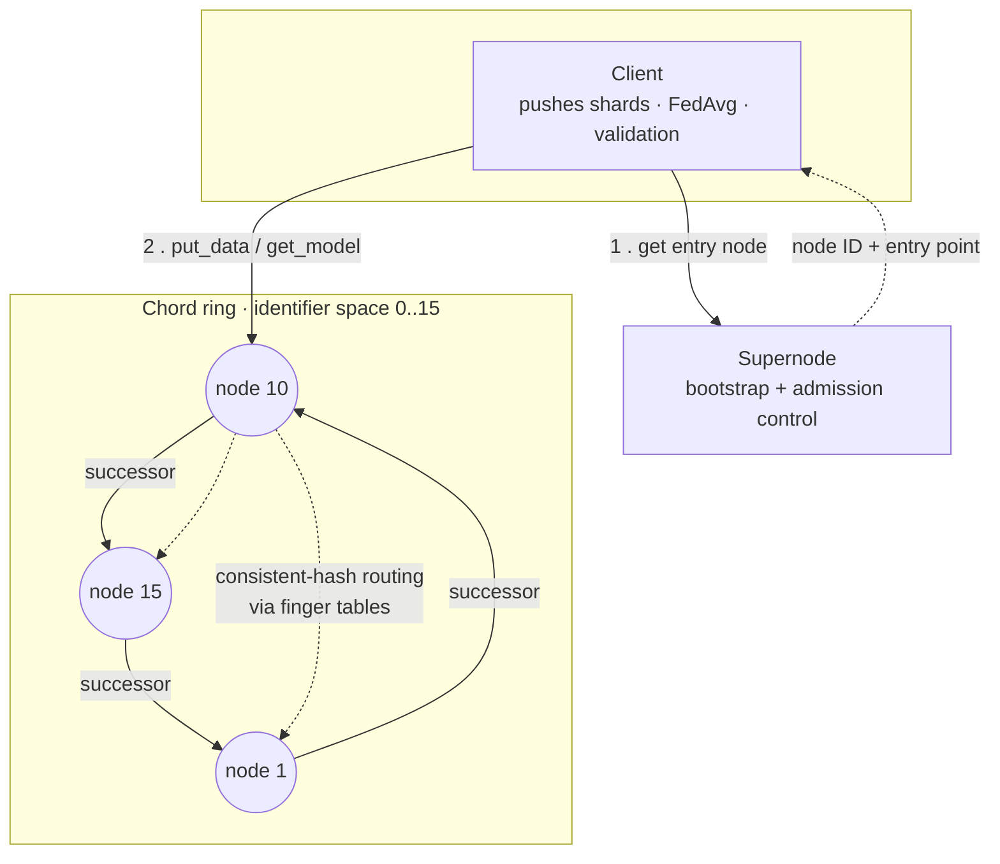

# Chord Federated Learning

A distributed **federated-learning** system built on top of a **Chord distributed hash table (DHT)**.
Training data is consistent-hashed and routed across a ring of compute nodes; each node trains a
local neural network on the shards it is responsible for, and a client aggregates all the local
models into a single global model using **federated averaging (FedAvg)**.

The project combines three areas:

- **Distributed systems**: a Chord ring with finger-table routing (`O(log N)` lookups), node join, and successor/predecessor maintenance.
- **RPC / serialization**: all node-to-node and client-to-node communication uses [Apache Thrift](https://thrift.apache.org/).
- **Machine learning**: a multi-layer perceptron (forward/backprop, softmax, momentum) implemented from scratch in NumPy, trained on a 26-class letter-recognition dataset.

## Architecture



**Roles**

| Component | File | Responsibility |
|-----------|------|----------------|
| Supernode | `supernode_server.py` | Bootstrap coordinator. Admits nodes one at a time, assigns each a Chord ID, and hands new clients/nodes an entry point into the ring. |
| Compute node | `compute_server.py` | Joins the ring, maintains a finger table + successor/predecessor, routes `put_data`/`get_model` by hash, and trains a local MLP on the shards it owns. |
| Client | `client.py` | Pushes all training shards into the ring, waits for local training, pulls each trained model back, aggregates with FedAvg, and reports validation error. |
| ML library | `ML/ML.py` | From-scratch NumPy MLP (ReLU hidden layer, softmax output, momentum SGD). |
| Shared config | `config.py` | Chord identifier space (`M`, `RING_SIZE`) and cluster capacity. |

## How it works

1. **Bootstrap.** Each compute node contacts the supernode (`request_join`), which serializes
   admissions and returns a unique node ID drawn from the identifier space `[0, RING_SIZE)`. If the
   supernode is mid-admission it replies *busy* and the joiner retries with backoff.
2. **Join.** The node initializes its finger table from an existing member, fixes its
   successor/predecessor, and propagates the new entry around the ring (`fix_fingers`).
3. **Data placement.** A file name is hashed (SHA-1 → `mod RING_SIZE`). `put_data` routes the file to
   the node responsible for that key using the finger table, and that node trains an MLP on it.
4. **Aggregation.** The client calls `get_model` for every shard (polling until training completes),
   sums the weight matrices, and scales by `1/N` to produce the FedAvg global model, then validates it.

## Quickstart

### Option A — Docker (recommended)

Brings up a supernode + 3 compute nodes + client on an isolated network. No local Python or Thrift
compiler needed.

```bash
docker compose up --build
```

You'll see the ring form and, after training, a line like `final validation error: 0.29`
(~71% validation accuracy on the 26-class letter-recognition task).
Tear down with `docker compose down -v`.

### Option B — Local (virtualenv)

Requires Python 3.12+ and the Thrift compiler (`thrift`) on your `PATH`.

```bash
make install          # create .venv, install deps, generate gen-py/
source .venv/bin/activate

# in separate terminals (or backgrounded), from the repo root:
python supernode_server.py 8000
python compute_server.py 127.0.0.1 8000 9000
python compute_server.py 127.0.0.1 8000 9001
python compute_server.py 127.0.0.1 8000 9002
python client.py 127.0.0.1 8000
```

`compute_nodes.txt` is the node registry (maps each compute port to its host); it ships with
`127.0.0.1` entries for local runs. The Docker setup mounts `docker/compute_nodes.txt`, which uses
container service names instead.

## Project layout

```
compute.thrift / supernode.thrift   Thrift service + struct definitions (source of truth for the RPC API)
config.py                           Chord identifier space (M, RING_SIZE) and cluster capacity
supernode_server.py                 Bootstrap / admission-control server
compute_server.py                   Chord node: routing, ring maintenance, local training
client.py                           Driver: shard distribution, FedAvg aggregation, validation
ML/ML.py                            From-scratch NumPy MLP
letters/ , validate_letters.txt     Letter-recognition training shards + validation set
gen-py/                             Thrift-generated stubs (gitignored; run `make gen`)
Dockerfile / docker-compose.yml     Containerized multi-node cluster
```

## Design notes

- **Identifier space.** Node IDs and key hashes share a single space `[0, RING_SIZE)` with
  `RING_SIZE = 2**M` (`config.py`). The power-of-two size is what makes finger offsets `2**i` tile the
  ring correctly.
- **Serialized joins.** The supernode admits one node at a time. Nodes started concurrently (as under
  Docker) retry on a *busy* response rather than failing.
- **Training.** The MLP uses a batch-mean gradient (so the learning rate is independent of shard size)
  and vectorized forward/backprop. Hyperparameters live in `config.py` and were tuned with an offline
  FedAvg harness; the shipped config reaches ~71% validation accuracy. Because the shards are IID and
  every local model starts from the same seed, FedAvg weight-averaging behaves like a mild ensemble and
  slightly *beats* the average individual model.
