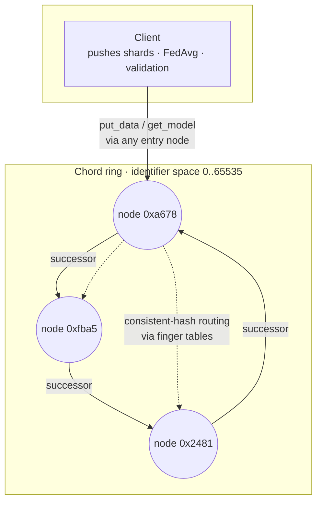

# Chord Federated Learning

A distributed **federated-learning** system built on top of a **Chord distributed hash table (DHT)**.
Training data is consistent-hashed and routed across a ring of compute nodes; each node trains a
local neural network on the shards it is responsible for, and a client aggregates all the local
models into a single global model using **federated averaging (FedAvg)**.

The project combines three areas:

- **Distributed systems**: a coordinator-free Chord ring with finger-table routing (`O(log N)` lookups), self-assigned node IDs, peer bootstrap, and successor/predecessor maintenance.
- **RPC**: all node-to-node and client-to-node communication uses [Apache Thrift](https://thrift.apache.org/).
- **Machine learning**: a multi-layer perceptron (forward/backprop, softmax, momentum) implemented in NumPy, trained on a 26-class letter-recognition dataset.

## Architecture



There is **no central coordinator**. Each node assigns its own Chord ID by
hashing its `host:port`, and a joining node bootstraps through any existing peer
given on the command line (the first node forms the ring alone).

**Roles**

| Component | File | Responsibility |
|-----------|------|----------------|
| Compute node | `compute_server.py` | Self-assigns a Chord ID, joins via a bootstrap peer (or forms the ring), maintains a finger table + successor/predecessor, routes `put_data`/`get_model` by hash, and trains a local MLP on the shards it owns. |
| Client | `client.py` | Connects to any entry node, pushes all training shards into the ring, waits for local training, pulls each trained model back, aggregates with FedAvg, and reports validation error. |
| ML library | `ML/ML.py` | Simple NumPy MLP (ReLU hidden layer, softmax output, momentum SGD). |
| Shared config | `config.py` | Chord identifier space (`M`, `RING_SIZE`) and ML hyperparameters. |

## How it works

1. **Naming.** Each compute node assigns itself an ID by hashing `host:port` into the identifier
   space `[0, RING_SIZE)`. The large space (`2**16`) makes collision chance negligible.
2. **Join.** The first node forms the ring alone. A later node is told one existing peer on the
   command line and finds its immediate successor through it. A background maintenance loop on
   every node (`stabilize` / `fix_fingers` / `check_predecessor`, running each second) ensures
   the successor/predecessor pointers and finger tables are correct. 
   Each node keeps a list of backup successors so a crash doesn't break the ring.
3. **Data placement.** A file name is hashed (SHA-1 → `mod RING_SIZE`). `put_data` routes the file to
   the node responsible for that key using the finger table, and that node trains an MLP on it.
4. **Aggregation.** The client calls `get_model` for every shard (polling until training completes),
   sums the weight matrices, and scales by `1/N` to produce the FedAvg global model, then validates it.

## Fault tolerance (node churn)

There is no coordinator and the ring repairs itself, so nodes can join or crash at any time.

- **Self-healing ring.** Every node runs a maintenance loop once a second (Chord `stabilize` /
  `fix_fingers` / `check_predecessor`) that deals with joins and failures. A stale finger table only
  slows lookups (and not break them), because the successor(immediate) entry is always correct.
- **Successor lists.** Each node tracks several successors (`SUCCESSOR_LIST_SIZE`), so if its
  immediate successor dies it assigns the backup as the new successor instead of the ring breaking.
- **Failure detection.** Every RPC has a timeout; a peer that doesn't answer is dropped from the
  finger table and successor list.
- **Model survival.** A finished model is copied to the backup successors, so if the owner dies its
  successor already has it. If a model is missing when requested, the new owner
  retrains it from the shard file. Either way the client still gets the results of all files that were requested to be trained.
- **Client failover.** The client is handed several entry nodes and reconnects to another if the one
  it is talking to dies, polling each shard until its model is ready.

Run the churn demo or the tests (below) to watch this in action.

## Quickstart

### Option A — Docker (recommended)

Brings up 3 compute nodes + client on an isolated network. No local Python or Thrift
compiler needed.

```bash
docker compose up --build
```

You'll see the ring form and, after training, a line like `final validation error: 0.29`
(~71% validation accuracy on the 26-class letter-recognition task).
Tear down with `docker compose down -v`.

### Option B — Local (virtualenv)

Requires Python 3.12+ and the Thrift compiler (`thrift`) on your `PATH`.

```bash
make install          # create .venv, install deps, generate gen-py/
source .venv/bin/activate

# in separate terminals (or backgrounded), from the repo root:
# first node forms the ring; the rest bootstrap through it (host port [bootstrap_host bootstrap_port])
python compute_server.py 127.0.0.1 9000
python compute_server.py 127.0.0.1 9001 127.0.0.1 9000
python compute_server.py 127.0.0.1 9002 127.0.0.1 9000
# the client takes one or more entry nodes and tries them in order
python client.py 127.0.0.1 9000 127.0.0.1 9001 127.0.0.1 9002
```

### Tests

```bash
make test        # or: .venv/bin/python tests/churn_test.py
```

Starts real nodes and a client and checks three things: the ring forms and trains to ~0.29, the ring
heals after a node is killed (lookups still resolve to live nodes), and a training run still finishes
when a node is killed mid-run. Node/client logs land in `tests/logs/`.

### Churn demo (Docker)

```bash
./demo/docker-chaos.sh        # or: make demo-chaos
```

Brings up the ring, runs the client, and kills a node while it is still training. You'll see the
survivors re-form the ring and the client still print `final validation error: ~0.29`.

## Project layout

```
compute.thrift                      Thrift service + struct definitions (source of truth for the RPC API)
config.py                           Chord identifier space (M, RING_SIZE) and ML hyperparameters
compute_server.py                   Basic unit in the Chord ring: self-naming, join, routing, ring maintenance, local training
client.py                           Simulates a client submitting a job: runs training shard distribution, FedAvg aggregation, validation
ML/ML.py                            NumPy MLP
letters/ , validate_letters.txt     Letter-recognition training shards + validation set
gen-py/                             Thrift-generated stubs (gitignored; run `make gen`)
Dockerfile / docker-compose.yml     Containerized multi-node cluster
tests/churn_test.py                 End-to-end tests (ring forms, heals, survives mid-run crash)
demo/docker-chaos.sh                Docker churn demo (kills a node mid-training)
```

## Design notes

- **Identifier space -** Node IDs and key hashes share a single space `[0, RING_SIZE)` with
  `RING_SIZE = 2**M` (`config.py`), which is how each training shard is assigned to a corresponding node.
- **Self-assigned IDs -** Nodes name themselves by hashing `host:port`, so there is no coordinator to
  hand out IDs or entry points. A joiner only needs the address of one existing peer.
- **Training -** The MLP uses a batch-mean gradient (so the learning rate is independent of shard size)
  and vectorized forward/backprop. Hyperparameters live in `config.py`; the config reaches ~71% validation accuracy. Because the shards are IID and
  every local model starts from the same seed, FedAvg weight-averaging behaves kind of like an ensemble and
  slightly beats the average individual model.
- **Training files -** The client sends the filenames of the training data during a request, which all compute nodes have access to locally.
